# Architecture

## Signal flow

```mermaid
flowchart LR
    IN[Input] --> GAIN[Input Gain<br/>-12..+24 dB]
    GAIN --> UP[4x Oversample]
    UP --> DET[Per-sample true-peak<br/>detection]
    DET --> MIN[Lookahead sliding-<br/>window minimum]
    MIN --> REL[Release<br/>curve-shaped smoothing]
    REL --> APPLY[Apply gain to<br/>lookahead-delayed signal]
    APPLY --> CLIP[Clip Mix blend<br/>tanh soft-clip path]
    CLIP --> CLAMP[Hard ceiling clamp]
    CLAMP --> DOWN[4x Downsample]
    DOWN --> METER[LUFS / true-peak<br/>metering]
    METER --> DITHER[Dither<br/>Off / 16-bit / 24-bit]
    DITHER --> OUT[Output]
```



Everything from the 4x oversample through the hard ceiling clamp runs entirely inside the oversampled domain, owned by `TruePeakLimiterEngine` (`src/dsp/TruePeakLimiterEngine.{h,cpp}`). Detection and gain-reduction *application* happen on the same high-resolution samples - the engine never detects an inter-sample peak at 4x and then tries to correct it after downsampling back to the host's rate. Metering and Dither are the only stages that operate at the base (post-downsample) rate - see their dedicated sections below.

## Module map

| Directory | Responsibility |
|---|---|
| `src/dsp` | All audio-thread DSP: `TruePeakLimiterEngine`, the complete signal chain (Input Gain, 4x-oversampled true-peak detection, lookahead gain-reduction envelope, curve-shaped release smoothing, Clip Mix blend, ceiling clamp, base-rate LUFS/true-peak metering, Dither). No allocation, locks, or I/O once `prepare()` has run. Independent of `juce::AudioProcessor` so it is directly unit-testable (see `tests/LimiterTests.cpp`, `tests/LatencyTests.cpp`, `tests/DspFeatureTests.cpp`, `tests/MeteringTests.cpp`). |
| `src/params` | Parameter layout and `AudioProcessorValueTreeState` definitions - parameter IDs, ranges, defaults. Single source of truth for what a preset captures. |
| `src/PluginProcessor.*` | Host plumbing: APVTS construction, `prepareToPlay`/`processBlock`/`reset`, latency reporting, state save/load, and thin metering-getter delegation to `TruePeakLimiterEngine`. Reads APVTS values and pushes them into `TruePeakLimiterEngine` every block; does not implement any DSP itself. |
| `src/PluginEditor.*` | A simple, functional v0.1 GUI: one rotary slider per continuous parameter (bound via `SliderAttachment`) plus two combo boxes for the discrete Release Curve/Dither choices (`ComboBoxAttachment`). Every automatable parameter has a working control. A custom vector-drawn GUI (including a visual metering display) is a later milestone (M3). |

Dependency direction is one-way: `PluginEditor` -> `params` (via attachments) and `PluginProcessor` -> `params` + `dsp`. `src/dsp` has no upward dependency on the processor or UI, which is what keeps `TruePeakLimiterEngine` testable in isolation.

## Detection and gain reduction: why both happen in the oversampled domain

A true-peak limiter has to guarantee the *reconstructed, continuous-time* signal never exceeds the ceiling - not just its sample values. Measuring the true peak at 4x oversampling but only *correcting* it afterwards, at the base rate, leaves a gap: the correction can't act on the very inter-sample energy that was detected, because by the time you're back at the base rate that information no longer exists as separate samples.

`TruePeakLimiterEngine` instead upsamples once (`juce::dsp::Oversampling`, half-band polyphase IIR, `useIntegerLatency = true`), then does **everything** - peak detection, the lookahead minimum-gain envelope, release smoothing, gain multiply, and a final hard ceiling clamp - directly on the 4x-rate samples, before downsampling back. The gain reduction therefore acts on exactly the same high-resolution representation that produced the true-peak reading, so the guarantee holds by construction rather than by inference.

## Lookahead: instantaneous attack without clipping

There is no separate "attack time" control. Instead:

1. For every oversampled sample, `TruePeakLimiterEngine` computes the **raw gain** needed right now to hit the (headroom-adjusted) ceiling: `min(1, ceiling / peak)`, where `peak` is the greater of the two (linked) channels' absolute values.
2. This raw-gain stream feeds a **sliding-window minimum** (a monotonic deque, `pushSlidingMin()` in `TruePeakLimiterEngine.cpp`) with a window covering "now" through `lookaheadSamplesOS` samples into the future. Because a monotonic deque naturally reports "the minimum value seen so far in the retained window" at every push, associating that minimum with the sample sitting `lookaheadSamplesOS` positions *behind* the newest arrival is exactly a lookahead operation - no separate attack time constant is needed, because the future peak is already known.
3. The **audio signal itself** is delayed by the same `lookaheadSamplesOS` (a small ring buffer per channel, `delayPushAndRead()`), so the gain value computed for "now" lines up sample-for-sample with the (delayed) audio it multiplies.
4. **Release** is the only smoothed phase, evaluated at the oversampled rate: when the required gain is *increasing* (releasing) rather than decreasing (attacking), `currentGain` moves towards the lookahead-minimum gain, shaped by the selected **Release Curve** (see below). Decreasing gain (attack) is applied immediately, *regardless of Release Curve* - it is already "in the past" as far as the raw detection stream is concerned, so there is nothing to smooth without reintroducing overshoot.

This is O(1) amortised per sample (the deque's total push/pop work is bounded by the number of samples processed) and uses only fixed-capacity buffers allocated in `prepare()` - no allocation on the audio thread.

## Release Curve: shaping the release phase

`ParamIDs::releaseCurve` (`TruePeakLimiterEngine::ReleaseCurve`) selects the shape of step 4 above - only the release (increasing-gain) phase, never attack:

- **Exponential** (index 0, default) - the original v0.1 one-pole ramp: `currentGain = target + (currentGain - target) * releaseCoeff`, where `releaseCoeff = exp(-1 / (releaseSeconds * oversampledRate))`. Fast initial recovery that tapers off logarithmically.
- **Linear** (index 1) - `currentGain` moves towards the target at a constant per-sample rate (`linearStepPerSample`, derived from Release so the full 0..1 gain range recovers in one Release-time-worth of samples), rather than tapering. More mechanical-sounding but very predictable.
- **Smooth** (index 2) - a two-stage cascade of the *same* one-pole coefficient (`smoothReleaseStage` follows the target, then `currentGain` follows `smoothReleaseStage`), i.e. a critically-damped second-order response. This gives a softer, overshoot-free onset to the release than a single pole, at the cost of an overall slower perceived release for the same Release time - the classic trade-off of adding a pole to a smoother.

The two curve-internal state variables (`currentGain`, `smoothReleaseStage`) are kept in lock-step on every **attack** sample (both snap to the lookahead-minimum gain), so switching Release Curve - or switching between attack and release - never resumes from a stale, lagging value. `tests/DspFeatureTests.cpp` verifies Exponential's default behaviour is unchanged from the pre-M1 engine, that the three curves produce materially different release trajectories, and that none of them ever overshoots unity gain or produces non-finite output.

## Clip Mix: an alternate soft-clip "clipper" path

`ParamIDs::clipMix` (0-100%, default 0%, smoothed like Ceiling) blends the transparent gain-reduction limiter path with an alternate waveshaping path, both evaluated per oversampled sample:

```
limiterSample = delayedSample * currentGain                                  // the existing gain-reduction path, unchanged
clipped       = clipTargetLinear * tanh(delayedSample / clipTargetLinear)     // independent tanh soft-clip, no gain envelope at all
outSample     = limiterSample + (clipped - limiterSample) * clipMixAmount
```

At 0% (default), the `if (clipMixAmount > 0.0f)` branch never executes, so the engine's output is bit-identical to the pure limiter path (regression-tested in `tests/DspFeatureTests.cpp`). At 100%, `outSample` is driven entirely by the tanh curve, independent of the lookahead gain envelope - a common modern loudness-maximiser technique.

Because the tanh curve generates new high-frequency harmonic content (unlike the linear gain-reduction path), its target uses extra headroom on top of `headroomMarginDb`, scaled by `clipMixAmount` (`TruePeakLimiterEngine::clipExtraHeadroomDb`, 1.0 dB at 100% mix, zero effect at 0%) to absorb the correspondingly larger downsample reconstruction-filter ripple. Regardless of the blend, the same unconditional final hard ceiling clamp (see below) still applies to `outSample` - the never-exceed-ceiling guarantee holds at every Clip Mix setting, verified directly in `tests/DspFeatureTests.cpp` at 100% mix using the same near-Nyquist inter-sample-peak test signal as `tests/LimiterTests.cpp`.

## Latency model

Reported latency (`TruePeakLimiterEngine::getLatencySamples()`, surfaced via `AudioProcessor::setLatencySamples()` in `prepareToPlay()`) is the sum of two independent, well-defined quantities:

```
totalLatencySamples = lookaheadSamplesBase + detectionLatencySamplesBase
```

- `lookaheadSamplesBase = round(LookaheadMs / 1000 * sampleRate)` - the Lookahead parameter, converted to base-rate samples.
- `detectionLatencySamplesBase = round(oversampler.getLatencyInSamples())` - the 4x oversampler's own round-trip (up + down) latency, which JUCE reports directly in base-rate samples when `useIntegerLatency = true` (`juce::dsp::Oversampling::getLatencyInSamples()`, JUCE 8.0.14).

**Lookahead is a "setup" parameter, not a live-automatable one.** `TruePeakLimiterEngine::setLookaheadMs()` only *latches* a new value; it is applied - resizing the lookahead delay buffer and the sliding-window-minimum's ring buffers - only inside the next `prepare()` call. `PluginProcessor::prepareToPlay()` seeds it from the APVTS before calling `engine.prepare()`, matching the sibling plugins' "seed before prepare" idiom. This is a deliberate scope decision: Lookahead directly changes the plugin's reported latency and the size of real-time buffers, neither of which should change mid-block on the audio thread. A host-side parameter change to Lookahead therefore only takes effect the next time the host re-prepares the plugin (sample-rate change, bypass toggle in most hosts, etc.), not instantaneously. InputGain, Ceiling, Release, and Clip Mix remain fully live-automatable, smoothed per block; Release Curve and Dither are cheap discrete-mode switches applied every block (no allocation, no buffer resize), so they can change instantly but are not zipper-smoothed - the same "discrete choice, not a continuous control" treatment the sibling plugins give their own voicing/mode selectors.

## Internal headroom margin

The gain-reduction *target* used internally is not the user-facing Ceiling directly, but `ceiling - headroomMarginDb` (0.3 dB, `TruePeakLimiterEngine::headroomMarginDb`). This absorbs the small amount of passband ripple/overshoot the oversampler's own downsampling (anti-imaging) filter can introduce when reconstructing an already-limited oversampled signal back to the base rate. Regardless of whether this margin is exactly right for a given input, a **final hard clamp** to the exact nominal ceiling is applied to every oversampled sample right before downsampling (see `process()` in `TruePeakLimiterEngine.cpp`) - the never-exceed guarantee does not depend on the margin's precision, only on this backstop.

## Dither

`ParamIDs::dither` (Off/16-bit/24-bit, default Off) adds TPDF (triangular-probability-density-function) noise, computed as `(rng.nextFloat() - rng.nextFloat()) * lsb` per sample per channel (two independent `juce::Random::nextFloat()` draws subtracted, giving a triangular distribution in `(-lsb, +lsb)`), where `lsb = 2^(1-16)` or `2^(1-24)`. This is applied **after** `oversampler->processSamplesDown()`, i.e. at the base rate, at the output word length - the conventional placement for dither, and deliberately *not* inside the oversampled loop (dithering before downsampling would have the downsample anti-imaging filter partially filter the dither itself, defeating its flat/triangular spectral intent at the base rate).

Off (the default) performs no computation and is bit-identical to the pre-M1 signal path (regression-tested in `tests/DspFeatureTests.cpp`). Dither's amplitude is tiny relative to the Ceiling (at most 1 LSB, roughly -90 dBFS for 16-bit and -138 dBFS for 24-bit), and no further clamp is applied after it - unlike the oversampled-domain hard clamp (see above), there is no equivalent backstop at the base rate. In practice this means Dither can push a discrete output sample up to ~1 LSB past the nominal ceiling, which is standard, expected mastering-limiter/dither behaviour and is far below the 0.5 dB tolerance this project's own true-peak tests already use (`tests/DspFeatureTests.cpp` verifies this directly with 16-bit dither, the larger of the two amplitudes, enabled).

## Metering (LUFS and true peak)

`TruePeakLimiterEngine` also computes and publishes (via relaxed `std::atomic<float>` members, safe for a GUI or test harness to poll from any thread - see `getGainReductionDb()`, `getOutputTruePeakDb()`, `getMomentaryLufs()`, `getShortTermLufs()`, `getIntegratedLufs()`) the following, updated once per processed (non-empty) block:

- **Gain reduction** - the minimum `currentGain` observed during the block, in dB. 0 dB idle, negative while limiting.
- **Output true peak** - the maximum `|outSample|` observed in the oversampled domain during the block (i.e. after the gain/Clip Mix/clamp stages, before downsampling), in dB. -100 dB idle floor.
- **Momentary / Short-Term / Integrated LUFS** - K-weighted loudness per ITU-R BS.1770-4, computed at the **base rate** (post-downsample, on the actual output signal): two cascaded biquads per channel (`kWeightShelf`/`kWeightHighPass`, `juce::dsp::IIR::Filter<float>`) implement the standard high-shelf + high-pass K-weighting pre-filter, re-derived per sample rate from the spec's analog-prototype parameters (`f0`/`Q`/gain for each stage) via `juce::dsp::IIR::Coefficients<float>::makeHighShelf`/`makeHighPass` rather than the spec's 48kHz-only published digital coefficients, so it is correct at every supported sample rate (44.1-192 kHz), not just 48 kHz. Momentary (400 ms) and Short-Term (3 s) are true sliding windows over the K-weighted mean power (`TruePeakLimiterEngine::LoudnessWindow`, a fixed-capacity ring buffer with an O(1) running sum, sized in `prepare()`); Integrated is a session-running accumulator, gated by the ITU absolute gate (-70 LUFS) evaluated once per processed block against that block's Momentary reading.

**Documented deviations from the full ITU-R BS.1770-4 algorithm**, both chosen to keep the implementation O(1) per sample/block and free of unbounded-duration allocation:
- Only the **absolute gate** (-70 LUFS) is implemented for Integrated Loudness; the spec's second-pass **relative gate** (-10 LU below the absolute-gated mean) is not. This means Integrated Loudness here will read slightly louder than a fully spec-compliant meter on programme material with significant quiet passages.
- The absolute gate is evaluated **once per processed block** (using that block's end-of-block Momentary reading), not continuously per the spec's overlapping 400 ms gating blocks. For typical host block sizes this is a finer granularity than the spec's blocks anyway, but it is not bit-identical to a reference implementation.
- All of this is a genuine, real-time-safe **estimate** suitable for a plugin's own reference metering, not a certified-accurate loudness-compliance meter; `tests/MeteringTests.cpp` accordingly uses broad, comparative assertions (louder signal -> higher LUFS reading; full-scale sine within a generous sane range) rather than exact reference values.

Displaying these values in the plugin's own UI (a visual meter) is GUI work, tracked for the custom-GUI milestone (M3) - this M1 work is the DSP-side computation and readout API only.

## NaN/Inf handling

`process()` sanitises non-finite (NaN/Inf) input samples to `0.0f` at the very start of every block, before they reach the oversampler. This matters specifically because the oversampler's internal IIR filter state is persistent across blocks: a single NaN sample that isn't caught would otherwise poison that filter state indefinitely, corrupting every subsequent block regardless of how "clean" the input becomes afterwards (see `tests/RobustnessTests.cpp`'s NaN/Inf sweep test).

## Real-time safety

- `ApotheosisAudioProcessor::processBlock()` starts with `juce::ScopedNoDenormals`.
- All DSP state (the oversampler, the lookahead delay buffer, the sliding-window-minimum ring buffers, the K-weighting filters, the Momentary/Short-Term loudness ring buffers) is allocated in `prepare()`/`prepareToPlay()` and never reallocated on the audio thread.
- `reset()` clears all oversampler/delay/envelope/metering state without deallocating (`TruePeakLimiterEngine::reset()`, called from both `AudioProcessor::reset()` and internally from `prepare()`). This includes zeroing Integrated LUFS's running accumulator - i.e. Integrated Loudness has transport-restart semantics, not indefinite cross-session accumulation.
- Parameter values are read via `apvts.getRawParameterValue()` atomics in `processBlock()`, never via `apvts.getParameter()->getValue()` or `String`-keyed lookups.
- Metering readouts (`getGainReductionDb()` etc.) are `std::atomic<float>`, written with `memory_order_relaxed` from the audio thread and readable from any thread (message-thread GUI polling in particular) without a lock.
- `TruePeakLimiterEngine::process()` treats a zero-sample block as a safe no-op before touching any oversampler/buffer/metering state (meters simply retain their last value).
- The sliding-window-minimum, lookahead delay buffer, and the Momentary/Short-Term loudness ring buffers are all fixed-capacity, sized once in `prepare()` from the (latched) Lookahead value and the prepared sample rate respectively; `process()` never grows them.
- Dither's `juce::Random` instance is a plain member (constructed once, not on the audio thread); `nextFloat()` itself performs no allocation.

## Known limitations (v0.1.0 scope)

- **Release Curve is a fixed, user-selected shape**, not a fully adaptive "programme-dependent" auto-release (e.g. automatically faster for transient material, slower for sustained content). Exponential/Linear/Smooth are three different *fixed* shapes the user picks explicitly; a genuinely adaptive auto-release remains a reasonable future enhancement.
- **True-peak verification methodology**: both the engine's internal detector and this project's own test suite (`TestHelpers::measureTruePeakLinear`) use the same `juce::dsp::Oversampling` half-band polyphase IIR technique to estimate true peak. This is internally consistent and matches the DSP spec's literal instruction ("oversampled true-peak of OUTPUT"), but it is not cross-checked against a fully independent measurement algorithm (e.g. a windowed-sinc or ITU-R BS.1770-style true-peak meter). The `+ small tolerance` (0.5 dB) used in `tests/LimiterTests.cpp` and `tests/DspFeatureTests.cpp` reflects this along with the internal headroom margin's imprecision, not a hard theoretical bound.
- **Lookahead is prepare-time latched**, as described above - not a click-free, live-automatable control. This is a deliberate, documented scope decision, not an oversight.
- **LUFS metering is a real-time-safe estimate**, not a certified-accurate ITU-R BS.1770-4 loudness meter - see the "Metering" section above for the specific documented deviations (absolute-gate-only, block-granularity gating).
- **Dither is not clamp-backstopped at the base rate** - see the "Dither" section above; its amplitude is small enough that this is standard, expected behaviour, not a guarantee violation in practice.
- **No visual metering in the GUI yet.** The metering DSP/readout API (this milestone) is complete and tested, but displaying it is GUI work tracked for the custom-GUI milestone (M3).
