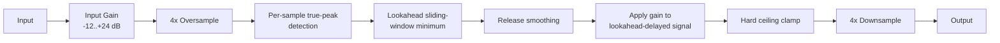

# Architecture

## Signal flow



Everything from the 4x oversample through the hard ceiling clamp runs entirely inside the oversampled domain, owned by `TruePeakLimiterEngine` (`src/dsp/TruePeakLimiterEngine.{h,cpp}`). Detection and gain-reduction *application* happen on the same high-resolution samples - the engine never detects an inter-sample peak at 4x and then tries to correct it after downsampling back to the host's rate.

## Module map

| Directory | Responsibility |
|---|---|
| `src/dsp` | All audio-thread DSP: `TruePeakLimiterEngine`, the complete signal chain (Input Gain, 4x-oversampled true-peak detection, lookahead gain-reduction envelope, release smoothing, ceiling clamp). No allocation, locks, or I/O once `prepare()` has run. Independent of `juce::AudioProcessor` so it is directly unit-testable (see `tests/LimiterTests.cpp`, `tests/LatencyTests.cpp`). |
| `src/params` | Parameter layout and `AudioProcessorValueTreeState` definitions - parameter IDs, ranges, defaults. Single source of truth for what a preset captures. |
| `src/PluginProcessor.*` | Host plumbing: APVTS construction, `prepareToPlay`/`processBlock`/`reset`, latency reporting, state save/load. Reads APVTS values and pushes them into `TruePeakLimiterEngine` every block; does not implement any DSP itself. |
| `src/PluginEditor.*` | A simple, functional v0.1 GUI: one rotary slider per parameter bound via `SliderAttachment`. A custom vector-drawn GUI is a later milestone. |

Dependency direction is one-way: `PluginEditor` -> `params` (via attachments) and `PluginProcessor` -> `params` + `dsp`. `src/dsp` has no upward dependency on the processor or UI, which is what keeps `TruePeakLimiterEngine` testable in isolation.

## Detection and gain reduction: why both happen in the oversampled domain

A true-peak limiter has to guarantee the *reconstructed, continuous-time* signal never exceeds the ceiling - not just its sample values. Measuring the true peak at 4x oversampling but only *correcting* it afterwards, at the base rate, leaves a gap: the correction can't act on the very inter-sample energy that was detected, because by the time you're back at the base rate that information no longer exists as separate samples.

`TruePeakLimiterEngine` instead upsamples once (`juce::dsp::Oversampling`, half-band polyphase IIR, `useIntegerLatency = true`), then does **everything** - peak detection, the lookahead minimum-gain envelope, release smoothing, gain multiply, and a final hard ceiling clamp - directly on the 4x-rate samples, before downsampling back. The gain reduction therefore acts on exactly the same high-resolution representation that produced the true-peak reading, so the guarantee holds by construction rather than by inference.

## Lookahead: instantaneous attack without clipping

There is no separate "attack time" control. Instead:

1. For every oversampled sample, `TruePeakLimiterEngine` computes the **raw gain** needed right now to hit the (headroom-adjusted) ceiling: `min(1, ceiling / peak)`, where `peak` is the greater of the two (linked) channels' absolute values.
2. This raw-gain stream feeds a **sliding-window minimum** (a monotonic deque, `pushSlidingMin()` in `TruePeakLimiterEngine.cpp`) with a window covering "now" through `lookaheadSamplesOS` samples into the future. Because a monotonic deque naturally reports "the minimum value seen so far in the retained window" at every push, associating that minimum with the sample sitting `lookaheadSamplesOS` positions *behind* the newest arrival is exactly a lookahead operation - no separate attack time constant is needed, because the future peak is already known.
3. The **audio signal itself** is delayed by the same `lookaheadSamplesOS` (a small ring buffer per channel, `delayPushAndRead()`), so the gain value computed for "now" lines up sample-for-sample with the (delayed) audio it multiplies.
4. **Release** is the only smoothed time constant: when the required gain is *increasing* (releasing) rather than decreasing (attacking), `currentGain` moves towards the lookahead-minimum gain via a one-pole coefficient derived from the Release (ms) parameter, evaluated at the oversampled rate. Decreasing gain (attack) is applied immediately - it is already "in the past" as far as the raw detection stream is concerned, so there is nothing to smooth without reintroducing overshoot.

This is O(1) amortised per sample (the deque's total push/pop work is bounded by the number of samples processed) and uses only fixed-capacity buffers allocated in `prepare()` - no allocation on the audio thread.

## Latency model

Reported latency (`TruePeakLimiterEngine::getLatencySamples()`, surfaced via `AudioProcessor::setLatencySamples()` in `prepareToPlay()`) is the sum of two independent, well-defined quantities:

```
totalLatencySamples = lookaheadSamplesBase + detectionLatencySamplesBase
```

- `lookaheadSamplesBase = round(LookaheadMs / 1000 * sampleRate)` - the Lookahead parameter, converted to base-rate samples.
- `detectionLatencySamplesBase = round(oversampler.getLatencyInSamples())` - the 4x oversampler's own round-trip (up + down) latency, which JUCE reports directly in base-rate samples when `useIntegerLatency = true` (`juce::dsp::Oversampling::getLatencyInSamples()`, JUCE 8.0.14).

**Lookahead is a "setup" parameter, not a live-automatable one.** `TruePeakLimiterEngine::setLookaheadMs()` only *latches* a new value; it is applied - resizing the lookahead delay buffer and the sliding-window-minimum's ring buffers - only inside the next `prepare()` call. `PluginProcessor::prepareToPlay()` seeds it from the APVTS before calling `engine.prepare()`, matching the sibling plugins' "seed before prepare" idiom. This is a deliberate scope decision: Lookahead directly changes the plugin's reported latency and the size of real-time buffers, neither of which should change mid-block on the audio thread. A host-side parameter change to Lookahead therefore only takes effect the next time the host re-prepares the plugin (sample-rate change, bypass toggle in most hosts, etc.), not instantaneously. InputGain, Ceiling, and Release remain fully live-automatable, smoothed per block.

## Internal headroom margin

The gain-reduction *target* used internally is not the user-facing Ceiling directly, but `ceiling - headroomMarginDb` (0.3 dB, `TruePeakLimiterEngine::headroomMarginDb`). This absorbs the small amount of passband ripple/overshoot the oversampler's own downsampling (anti-imaging) filter can introduce when reconstructing an already-limited oversampled signal back to the base rate. Regardless of whether this margin is exactly right for a given input, a **final hard clamp** to the exact nominal ceiling is applied to every oversampled sample right before downsampling (see `process()` in `TruePeakLimiterEngine.cpp`) - the never-exceed guarantee does not depend on the margin's precision, only on this backstop.

## NaN/Inf handling

`process()` sanitises non-finite (NaN/Inf) input samples to `0.0f` at the very start of every block, before they reach the oversampler. This matters specifically because the oversampler's internal IIR filter state is persistent across blocks: a single NaN sample that isn't caught would otherwise poison that filter state indefinitely, corrupting every subsequent block regardless of how "clean" the input becomes afterwards (see `tests/RobustnessTests.cpp`'s NaN/Inf sweep test).

## Real-time safety

- `ApotheosisAudioProcessor::processBlock()` starts with `juce::ScopedNoDenormals`.
- All DSP state (the oversampler, the lookahead delay buffer, the sliding-window-minimum ring buffers) is allocated in `prepare()`/`prepareToPlay()` and never reallocated on the audio thread.
- `reset()` clears all oversampler/delay/envelope state without deallocating (`TruePeakLimiterEngine::reset()`, called from both `AudioProcessor::reset()` and internally from `prepare()`).
- Parameter values are read via `apvts.getRawParameterValue()` atomics in `processBlock()`, never via `apvts.getParameter()->getValue()` or `String`-keyed lookups.
- `TruePeakLimiterEngine::process()` treats a zero-sample block as a safe no-op before touching any oversampler/buffer state.
- The sliding-window-minimum and lookahead delay buffer are both fixed-capacity, sized once in `prepare()` from the (latched) Lookahead value; `process()` never grows them.

## Known limitations (v0.1 scope)

- **Release is a single fixed time constant**, not a fully adaptive "programme-dependent" scheme (e.g. faster release automatically for transient material, slower for sustained content). The DSP spec's "smooth programme-dependent Release" is implemented here as: attack is inherently instantaneous (via lookahead, not a time constant at all) and release is a conventional one-pole ramp at the user-set Release time. A genuinely adaptive auto-release is a reasonable v0.2 enhancement.
- **True-peak verification methodology**: both the engine's internal detector and this project's own test suite (`TestHelpers::measureTruePeakLinear`) use the same `juce::dsp::Oversampling` half-band polyphase IIR technique to estimate true peak. This is internally consistent and matches the DSP spec's literal instruction ("oversampled true-peak of OUTPUT"), but it is not cross-checked against a fully independent measurement algorithm (e.g. a windowed-sinc or ITU-R BS.1770-style true-peak meter). The `+ small tolerance` (0.5 dB) used in `tests/LimiterTests.cpp` reflects this along with the internal headroom margin's imprecision, not a hard theoretical bound.
- **Lookahead is prepare-time latched**, as described above - not a click-free, live-automatable control. This is a deliberate, documented scope decision, not an oversight.
