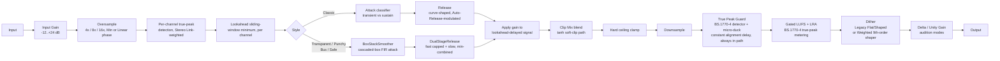

# Architecture

## Signal flow


```mermaid
flowchart LR
    IN[Input] --> GAIN[Input Gain<br/>-12..+24 dB]
    GAIN --> UP[Oversample<br/>4x / 8x / 16x, Min or Linear phase]
    UP --> DET[Per-channel true-peak<br/>detection, Stereo Link-weighted]
    DET --> MIN[Lookahead sliding-<br/>window minimum, per channel]
    MIN --> STYLE{Style}
    STYLE -->|Classic| ATT[Attack classifier<br/>transient vs sustain]
    ATT --> REL[Release<br/>curve-shaped, Auto-Release-modulated]
    STYLE -->|Transparent / Punchy<br/>Bus / Safe| BOX[BoxStackSmoother<br/>cascaded-box FIR attack]
    BOX --> DUAL[DualStageRelease<br/>fast capped + slow, min-combined]
    REL --> APPLY[Apply gain to<br/>lookahead-delayed signal]
    DUAL --> APPLY
    APPLY --> CLIP[Clip Mix blend<br/>tanh soft-clip path]
    CLIP --> CLAMP[Hard ceiling clamp]
    CLAMP --> DOWN[Downsample]
    DOWN --> GUARD[True Peak Guard<br/>BS.1770-4 detector + micro-duck<br/>constant alignment delay, always in path]
    GUARD --> METER[Gated LUFS + LRA<br/>BS.1770-4 true-peak metering]
    METER --> DITHER[Dither<br/>Legacy Flat/Shaped<br/>or Weighted 9th-order shaper]
    DITHER --> MON[Delta / Unity Gain<br/>audition modes]
    MON --> OUT[Output]
```

Everything from the 4x oversample through the hard ceiling clamp runs entirely inside the oversampled domain, owned by `TruePeakLimiterEngine` (`src/dsp/TruePeakLimiterEngine.{h,cpp}`). Detection and gain-reduction *application* happen on the same high-resolution samples - the engine never detects an inter-sample peak at 4x and then tries to correct it after downsampling back to the host's rate. The True Peak Guard, metering, Dither and the two audition modes are the stages that operate at the base (post-downsample) rate - see their dedicated sections below. That placement is deliberate for the guard and the true-peak readout: the base-rate signal is what a delivery meter actually measures, so measuring it anywhere else would be measuring something the user never receives.

**v0.4.0** adds seven more - Style, Oversampling, OS Filter, True Peak Guard, Noise Shaping, Delta, Unity Gain - plus a fixed-rate Auto Release integrator and a rewritten, spec-compliant loudness meter. Same additive contract: every default reproduces v0.2.0's output bit-for-bit (`tests/RegressionTests.cpp`'s golden-fixture comparison against committed v0.2.0 renders), with one documented exception - a constant integer guard delay of 6 base samples below 176.4 kHz. See "v0.4.0 additions" below.

**v0.2.0** (`docs/design-brief.md`) adds four research-derived controls - Attack, Auto Release, Stereo Link, Dither Shape - each purely additive, each defaulting to the value that reproduces v1's exact prior behaviour bit-for-bit (see "v0.2.0 additions" below and `tests/RegressionTests.cpp`). This is also why the gain envelope and the sliding-window-minimum, described as a single shared instance throughout the rest of this document for v1, are **per channel** as of v0.2.0 - see "Stereo Link" below for why, and `TruePeakLimiterEngine.h`'s class-level docs for the exact mechanism that keeps them numerically identical to v1's single shared envelope at the (default) 100% Stereo Link setting.

## Module map

| Directory | Responsibility |
|---|---|
| `src/dsp` | All audio-thread DSP: `TruePeakLimiterEngine`, the complete signal chain (Input Gain, oversampled per-channel true-peak detection, lookahead gain-reduction envelope, the Style dispatch and its envelope stages, Clip Mix blend, ceiling clamp, True Peak Guard, base-rate metering, Dither). No allocation, locks, or I/O once `prepare()` has run. Independent of `juce::AudioProcessor` so it is directly unit-testable (see `tests/LimiterTests.cpp`, `tests/LatencyTests.cpp`, `tests/DspFeatureTests.cpp`, `tests/MeteringTests.cpp`, `tests/AttackAutoReleaseTests.cpp`, `tests/StereoLinkDitherShapeTests.cpp`, `tests/RegressionTests.cpp`, `tests/StyleEngineTests.cpp`, `tests/TruePeakVerificationTests.cpp`). Four header-only collaborators keep the engine's `.cpp` from becoming the whole plugin, and are unit-tested directly: `TruePeakInterpolator.h` (BS.1770-4 polyphase detector + rate policy + guard-delay constants), `GainEnvelopeStages.h` (`BoxStackSmoother`, `DualStageRelease`), `PsychoacousticDither.h` (per-channel TPDF + 9th-order error-feedback shaper), `GatedLoudnessMeter.h` (sub-block accumulation, gating histograms, Integrated + LRA). |
| `src/params` | Parameter layout and `AudioProcessorValueTreeState` definitions - parameter IDs, ranges, defaults. Single source of truth for what a preset captures. |
| `src/presets` | The M2 suite-wide preset system (`PresetManager`, `PresetBar`, `Localisation`) - copied verbatim from the pilot implementation (`basilica-audio/nave`, see `docs/preset-system-notes.md`'s replication recipe), with only the small per-plugin config surface (`PresetManagerConfig`, factory `BinaryData::` asset list) written for Apotheosis. See "M2 preset system" and "i18n frame" below. |
| `src/PluginProcessor.*` | Host plumbing: APVTS construction, `prepareToPlay`/`processBlock`/`reset`, latency reporting, state save/load, `PresetManager` construction/startup-default resolution, and thin metering-getter delegation to `TruePeakLimiterEngine`. Reads APVTS values and pushes them into `TruePeakLimiterEngine` every block; does not implement any DSP itself. |
| `src/PluginEditor.*`, `src/PluginEditorLayout.h` | **M3 photoreal skeuomorphic GUI** (v0.3.0): a pre-rendered stone/gunmetal faceplate with engraved bays, brass filmstrip knobs for the eight continuous parameters, plain (BasilicaLookAndFeel-styled) combo boxes for the three discrete choices, and three `AnalogMeter` needle displays (Gain Reduction / True Peak / LUFS) fed from the engine's existing metering atomics. Built from the suite-reusable `src/gui/` component family (copied verbatim from the M3 pilot, `basilica-audio/silentium`); see `docs/gui-components.md` for the component architecture and this plugin's specific layout/metering-mapping choices. |
| `src/gui/*` | Suite-reusable, plugin-agnostic GUI components: `FilmstripKnob`, `FilmstripToggle` (unused here - no boolean parameters), `AnalogMeter`, `BasilicaLookAndFeel`, `ImageDensity.h`. Take asset images and generic config through their constructors, not Apotheosis's parameter IDs. |

Dependency direction is one-way: `PluginEditor` -> `params` (via attachments) and `PluginProcessor` -> `params` + `dsp`. `src/dsp` has no upward dependency on the processor or UI, which is what keeps `TruePeakLimiterEngine` testable in isolation.

## Detection and gain reduction: why both happen in the oversampled domain

A true-peak limiter has to guarantee the *reconstructed, continuous-time* signal never exceeds the ceiling - not just its sample values. Measuring the true peak at 4x oversampling but only *correcting* it afterwards, at the base rate, leaves a gap: the correction can't act on the very inter-sample energy that was detected, because by the time you're back at the base rate that information no longer exists as separate samples.

`TruePeakLimiterEngine` instead upsamples once (`juce::dsp::Oversampling`, half-band polyphase IIR, `useIntegerLatency = true`), then does **everything** - peak detection, the lookahead minimum-gain envelope, release smoothing, gain multiply, and a final hard ceiling clamp - directly on the 4x-rate samples, before downsampling back. The gain reduction therefore acts on exactly the same high-resolution representation that produced the true-peak reading, so the guarantee holds by construction rather than by inference.

## Lookahead: instantaneous attack without clipping

There is no separate "attack time" control. Instead:

1. For every oversampled sample, `TruePeakLimiterEngine` computes the **raw gain** needed right now to hit the (headroom-adjusted) ceiling: `min(1, ceiling / peak)`, where `peak` is the greater of the two (linked) channels' absolute values.
2. This raw-gain stream feeds a **sliding-window minimum** (a monotonic deque, `pushSlidingMin()` in `TruePeakLimiterEngine.cpp`) with a window covering "now" through `lookaheadSamplesOS` samples into the future. Because a monotonic deque naturally reports "the minimum value seen so far in the retained window" at every push, associating that minimum with the sample sitting `lookaheadSamplesOS` positions *behind* the newest arrival is exactly a lookahead operation - no separate attack time constant is needed, because the future peak is already known.
3. The **audio signal itself** is delayed by the same `lookaheadSamplesOS` (a small ring buffer per channel, `delayPushAndRead()`), so the gain value computed for "now" lines up sample-for-sample with the (delayed) audio it multiplies.
4. **Release** is the only smoothed phase, evaluated at the oversampled rate: when the required gain is *increasing* (releasing) rather than decreasing (attacking), `currentGain` moves towards the lookahead-minimum gain, shaped by the selected **Release Curve** (see below). Decreasing gain (attack) is applied immediately, *regardless of Release Curve* - it is already "in the past" as far as the raw detection stream is concerned, so there is nothing to smooth without reintroducing overshoot.

This is O(1) amortised per sample (the deque's total push/pop work is bounded by the number of samples processed) and uses only fixed-capacity buffers allocated in `prepare()` - no allocation on the audio thread.

## Release Curve: shaping the release phase

`ParamIDs::releaseCurve` (`TruePeakLimiterEngine::ReleaseCurve`) selects the shape of step 4 above - only the release (increasing-gain) phase, never attack:

- **Exponential** (index 0, default) - the original v0.1 one-pole ramp: `currentGain = target + (currentGain - target) * releaseCoeff`, where `releaseCoeff = exp(-1 / (releaseSeconds * oversampledRate))`. Fast initial recovery that tapers off logarithmically.
- **Linear** (index 1) - `currentGain` moves towards the target at a constant per-sample rate (`linearStepPerSample`, derived from Release so the full 0..1 gain range recovers in one Release-time-worth of samples), rather than tapering. More mechanical-sounding but very predictable.
- **Smooth** (index 2) - a two-stage cascade of the *same* one-pole coefficient (`smoothReleaseStage` follows the target, then `currentGain` follows `smoothReleaseStage`), i.e. a critically-damped second-order response. This gives a softer, overshoot-free onset to the release than a single pole, at the cost of an overall slower perceived release for the same Release time - the classic trade-off of adding a pole to a smoother.

The two curve-internal state variables (`currentGain`, `smoothReleaseStage`) are kept in lock-step on every **attack** sample (both snap to the lookahead-minimum gain), so switching Release Curve - or switching between attack and release - never resumes from a stale, lagging value. `tests/DspFeatureTests.cpp` verifies Exponential's default behaviour is unchanged from the pre-M1 engine, that the three curves produce materially different release trajectories, and that none of them ever overshoots unity gain or produces non-finite output.

## Clip Mix: an alternate soft-clip "clipper" path

`ParamIDs::clipMix` (0-100%, default 0%, smoothed like Ceiling) blends the transparent gain-reduction limiter path with an alternate waveshaping path, both evaluated per oversampled sample:

```
limiterSample = delayedSample * currentGain                                  // the existing gain-reduction path, unchanged
clipped       = clipTargetLinear * tanh(delayedSample / clipTargetLinear)     // independent tanh soft-clip, no gain envelope at all
outSample     = limiterSample + (clipped - limiterSample) * clipMixAmount
```

At 0% (default), the `if (clipMixAmount > 0.0f)` branch never executes, so the engine's output is bit-identical to the pure limiter path (regression-tested in `tests/DspFeatureTests.cpp`). At 100%, `outSample` is driven entirely by the tanh curve, independent of the lookahead gain envelope - a common modern loudness-maximiser technique.

Because the tanh curve generates new high-frequency harmonic content (unlike the linear gain-reduction path), its target uses extra headroom on top of `headroomMarginDb`, scaled by `clipMixAmount` (`TruePeakLimiterEngine::clipExtraHeadroomDb`, 1.0 dB at 100% mix, zero effect at 0%) to absorb the correspondingly larger downsample reconstruction-filter ripple. Regardless of the blend, the same unconditional final hard ceiling clamp (see below) still applies to `outSample` - the never-exceed-ceiling guarantee holds at every Clip Mix setting, verified directly in `tests/DspFeatureTests.cpp` at 100% mix using the same near-Nyquist inter-sample-peak test signal as `tests/LimiterTests.cpp`.

## v0.2.0 additions (Attack, Auto Release, Stereo Link, Dither Shape)

Research-derived from a competitor's own published help documentation (FabFilter Pro-L 2), a competitor's own published manual page (iZotope Ozone Maximizer), general audio-DSP dithering literature, and the ITU-R BS.1770 true-peak specification's documented behaviour - **not measured against, benchmarked against, or reverse-engineered from any competitor's actual binary/DSP**. See `docs/research-notes.md` for the full sourcing and `docs/design-brief.md` for the reasoning behind every new default. None of the four controls below change v1's default behaviour: each one's default is, individually, the value that reproduces v1's exact prior output - `tests/RegressionTests.cpp` verifies this directly with a bit-for-bit comparison across a v1-style test-signal corpus.

### Attack: transient/sustain classification

`ParamIDs::attack` (0-50 ms, linear, default 0 ms) is **not a gain-reduction ramp** (this is not a compressor retrofit) - it is a *classification window* layered on top of the existing lookahead sliding-window-minimum mechanism, mirroring the reference class's documented two-stage transient/sustain architecture (a fast transient stage that "releases near-instantly regardless of the Release knob", and a slower sustain stage the Release control actually shapes - `docs/research-notes.md` S2a).

For each channel, `TruePeakLimiterEngine::processChunk()` tracks how many consecutive oversampled samples the **windowed** (lookahead-min) gain has stayed below unity - a candidate gain-reduction "event". This is deliberately measured on the windowed gain, not the raw pre-window gain: raw per-sample gain dips below unity only within each audio cycle's brief peak excursion for any oscillating programme material and returns to unity near every zero-crossing, so a raw-gain-based duration would misclassify essentially all continuous, genuinely-sustained loud material as a string of ultra-short "transients" - the windowed gain (the same signal that already drives the attack/release envelope) persists below unity for the actual perceptually-relevant duration a loud passage keeps the limiter engaged, which is the duration this classifier needs.

When a channel enters its release (recovering-gain) phase, if the most recently completed event's duration was shorter than the current Attack setting, its recovery uses a **fixed, near-instant** release coefficient (`TruePeakLimiterEngine::fastAttackReleaseMs`, 1 ms - independent of Release, Release Curve, or Auto Release entirely, mirroring the reference class's "transient stage releases near-instantly regardless of the release setting"). Longer events use the normal Release-governed path (Release Curve, optionally Auto-Release-modulated - see below). At Attack = 0 ms (the default), no event's duration can ever be shorter than 0, so every event is classified "sustained" and the engine always takes the normal path - **bit-identical to v1** at the default.

### Auto Release: program-dependent release-time modulation

`ParamIDs::autoRelease` (0-100%, default 0%) modulates the *effective* Release time fed into the existing Exponential/Linear/Smooth curve state machine, based on a slow-moving (2 second time constant, `TruePeakLimiterEngine::autoReleaseTimeConstantSeconds`) running average of recent gain-reduction depth (`autoReleaseDepthAvgDb`, updated once per processed chunk from that chunk's own measured depth - a one-chunk-delayed, causal update, the same "smoothed value computed once per chunk" granularity `ceilingSmoothed`/`clipMixSmoothed` already use). This is a reasoned, from-scratch implementation of the *documented qualitative principle* found in the reference class's IRC/ARC lineage ("reacting quickly to transients while responding more slowly to... sustained content", `docs/research-notes.md` S3) - **not a reverse-engineered copy of any vendor's specific proprietary algorithm**, whose internals were not observed in this research pass.

The modulation is deliberately **asymmetric** around the idle baseline (`depthNorm == 0`, i.e. "nothing has needed gain reduction recently"): depth approaching the reference maximum (`autoReleaseModDepthReferenceDb`, 4 dB - a genuinely sustained passage saturates the average toward this) can lengthen the effective Release time up to 2.5x at 100% Auto Release (`autoReleaseLengthenRangeFraction`), while an idle/near-zero average only shortens it modestly, down to 0.7x (`autoReleaseShortenRangeFraction`). This asymmetry is what makes an isolated, brief peak's own post-peak recovery change only mildly across the full Auto Release range (its own averaged depth barely moves off the idle baseline, since one brief peak against a multi-second averager stays close to it) while a sustained, dense passage's recovery changes dramatically (its averaged depth saturates near the reference) - `tests/AttackAutoReleaseTests.cpp` verifies both the monotonic lengthening on a dense passage and the comparatively small swing on an isolated peak directly. At Auto Release = 0% the modulation multiplier is exactly `1.0f` regardless of the averaged depth (`0.0f * anything == 0.0f` in both branches of the asymmetric formula), so the effective Release time is bit-identical to the plain Release value v1 used - **bit-identical to v1** at the default.

Auto Release never affects the Attack classifier's fixed fast-path coefficient (above) - only the normal Release-curve-governed path.

### Stereo Link: per-channel detection crossfade

`ParamIDs::stereoLink` (0-100%, default 100%) blends each channel's true-peak detector input between "shared, max-linked across channels" (100%, v1's only behaviour) and "each channel detects and limits fully independently" (0%). Implementing this requires each channel to have its own gain envelope and sliding-window-minimum state - v1's single shared `currentGain`/`smoothReleaseStage`/sliding-window are therefore **per channel** as of v0.2.0 (`TruePeakLimiterEngine::maxChannels == 2`, matching the mono/stereo-only bus-layout contract).

At every oversampled sample, each channel's detector input is a crossfade: `peakForChannel = linkedPeak * stereoLinkAmount + perChannelPeak[channel] * (1 - stereoLinkAmount)`, where `linkedPeak` is the same max-across-channels value v1 always used. At Stereo Link = 100% (default), `peakForChannel` equals `linkedPeak` for *every* channel - each channel's independent envelope receives an identical input sequence to every other channel's, so all channels converge on the exact same `currentGain` trajectory v1's single shared envelope produced (same arithmetic, same inputs, same result) - **bit-identical to v1** at the default. At 0%, each channel's detector sees only its own peak, fully decoupling cross-channel triggering (useful when hard-panned content would otherwise pull the whole stereo image toward mono-triggering behaviour on a fully linked detector). `tests/StereoLinkDitherShapeTests.cpp` verifies the sweep directly: a peak in only the left channel produces a monotonically-decreasing (toward zero) pull on the right channel's gain reduction as Stereo Link decreases, while the left channel's own gain reduction stays essentially constant (it's always driven by its own peak, never by the crossfade).

This all happens entirely inside the existing oversampled block - no new aliasing risk beyond what v1 already manages, since Stereo Link changes *which peak value feeds* each channel's detector, not the detector's own filtering.

## v0.4.0 additions (Style, Oversampling, OS Filter, True Peak Guard, Noise Shaping, Delta, Unity Gain)

Seven new parameters, all additive, all defaulting to the value that reproduces v0.2.0's output bit-for-bit. The safety net for that claim is not an argument but a corpus: commit 1 of the v0.4.0 branch - made while the engine was still byte-identical to v0.2.0 - rendered the existing five-signal test corpus plus a 16-bit dither case to raw float32 files under `tests/fixtures/v020/`, with a manifest recording settings, SHA-256 and the generating platform/compiler. Every subsequent commit is compared against those files (`tests/RegressionTests.cpp` T1), bit-exact on the generation platform and within 1e-7 elsewhere, since float determinism is compiler- and architecture-specific.

### Style: FIR-smoothed attack and dual concurrent release

`ParamIDs::limitStyle` dispatches at the **top** of the envelope section, not through interleaved conditionals. That structure is deliberate and binding: Classic must remain the literal v0.2.0 code path, because the per-channel envelope code is the most regression-sensitive area of the plugin and the golden-fixture corpus is the upgrade safety net. A conditional threaded through the v0.2.0 arithmetic would be a much easier way to write it and a much harder way to trust it.

The four non-Classic styles replace two stages:

**`BoxStackSmoother` (attack).** The existing per-channel monotonic-deque sliding-window minimum is kept - it is already O(1) amortised and regression-proven - and its output is then fed through two or three cascaded moving averages of `N/2` (or `N/3`) samples each. The point is the **zero-overshoot proof obligation**: a finite mean of values that are each at least the window minimum is itself at least that window minimum, so with the audio delayed by exactly `N` samples the applied gain can never be *less* attenuating than required. No overshoot by construction - and `tests/StyleEngineTests.cpp`'s T2 asserts it with the final safety clamp **bypassed** via an `APOTHEOSIS_TESTING`-gated hook, across 10 000 randomised signals crossed with four styles and three lookahead settings. A clamp-on test would only prove the clamp works.

Why this matters sonically: a rectangular sliding minimum produces a gain envelope with sharp corners, and sharp corners in a multiplicative envelope are broadband modulation. On bass-heavy programme the sidebands land in the audible midrange as intermodulation distortion.

**T4 is a deviation from the brief, and the honest result is smaller than the brief expected.** The brief anticipated Classic measuring at least 3x Transparent's THD on 50 Hz driven 3 dB over the ceiling at 10 ms lookahead. It does not: both measure ~1.7e-8, far under the 1 % bound. The reason is architectural and is a credit to the existing design - the brief's expectation was adapted from a reference architecture whose sliding-minimum window is *attack*-sized, whereas this engine's window has been **lookahead**-sized since v0.1, so at 10 ms it already bridges the 50 Hz half-period for Classic and the new styles alike. A 3x ratio between two effectively-zero numbers is not assertable, and asserting it would have meant tuning the test until it produced the expected answer.

What T4 asserts instead: Transparent stays under the 1 % bound (the product claim, unchanged); Classic is equally clean at the same settings (regression-protecting the existing strength); and the lookahead window is demonstrably what prevents the distortion - shrink it to 3 ms, below the 50 Hz half-period, and the same Transparent render distorts to 5.5 %, over three orders of magnitude worse. The smoother's real contribution is the zero-overshoot guarantee and envelope smoothness under transient-dense material, not a low-frequency THD win over Classic at generous lookahead settings.

Running sums accumulate in `double` with an exact re-summation every 2^14 samples. Float running sums drift, and drift in a gain envelope is audible.

**`DualStageRelease`.** Two concurrent exponential followers, both fed from the smoothed trace `s[n]`, replacing v0.2.0's binary transient/sustain classifier: `r[n] = min(s[n], r_fast_capped[n] * r_slow[n])`, with the fast follower depth-capped to the top `D` dB of gain reduction. The division of labour is that the fast stage handles transient tops while the slow stage carries programme gain reduction, and because they run concurrently rather than being selected between, there is no classification decision to get wrong - which is what the binary classifier could do on material sitting near its threshold. Per-style constants (smoother width, tau_fast, tau_slow, cap D) are in the table in `docs/manual.md`.

T3 asserts the envelope against a **test-side double-precision implementation of the exact recurrence** within 0.02 dB per sample, plus a tail-slope check against a pure tau_slow exponential. Note what is deliberately *not* asserted: the closed-form `1 - e^-t (1+t)` shape belongs to the equal-tau cascade that the existing "Smooth" Release Curve implements, and is not the curve family a min-combined dual-stage produces. Fitting the wrong closed form would have been a test that passed for the wrong reason.

**Switching styles is click-free by state continuity**: the release stages are re-seeded from the current gain rather than snapped, so an automated Style change does not step the envelope.

### Fixed-rate Auto Release (F7)

In non-Classic styles the gain-reduction depth running average that drives Auto Release updates at a **fixed internal cadence** - every `fs_os / 100` oversampled samples (10 ms) - with the one-pole coefficient computed for exactly that cadence. v0.2.0 updated it once per host chunk, which made the modulation depend on the host's buffer size and therefore made a render at 64 samples differ from the same render at 2048. `tests/StyleEngineTests.cpp` T8 nulls those two renders against each other to at least 80 dB. Classic keeps the per-chunk law verbatim and is exempt by design, since bit-identity with v0.2.0 outranks buffer invariance for the compatibility path.

### True Peak Guard and the verified true-peak measurement

`TruePeakInterpolator` implements BS.1770-4 Annex 2 directly: a 4x polyphase FIR, 12 taps per phase, the standard's 48 coefficients as a `constexpr` table, with the phase symmetry (`Phase3 == reverse(Phase0)`) asserted at **compile time**. The +-12.04 dB integer-headroom pair is skipped, correctly, because this is a float path. Rate policy follows libebur128: 4x below 88.2 kHz, 2x from 88.2-96 kHz, and pass-through maximum at 176.4 kHz and above. The 2x tier is implemented as the *same* 48-coefficient bank emitting only phases 0 and 2 - one prototype, one group delay, no second filter to design or keep consistent.

With `tpGuard` on, the detector runs on the base-rate output and, while the measured true peak exceeds the ceiling, ducks the output by exactly the excess (`ceiling / measuredTP` in the linear domain), attack under 0.1 ms, release 5 ms, only for the duration of the over. It is a micro-correction, not a second limiter.

**What the guard actually guarantees, and how the tests say so honestly.** A compliant 4x meter can under-read the true peak by up to 0.554 dB near f_norm 0.45; the guard corrects until *its own* 4x detector reads at or below the ceiling. So the product claim is precisely "a BS.1770-4-compliant 4x meter reads at or below your ceiling", and T7 asserts it in three parts rather than one: (a) an independent test-side copy of the same compliant 4x meter reads <= ceiling + 0.05 dB on every corpus item including the 0.45*fs one - the actual claim; (b) a test-only 8x 192-tap reference meter reads <= ceiling + 0.65 dB corpus-wide, which budgets the 4x under-read rather than pretending it away; (c) the tight +0.05 dB bound against the 8x reference, restricted to corpus items whose content is below fs/8 where the under-read is negligible. A single tight assertion against the 8x reference on the 0.45*fs item would have been a stronger-looking test that the design cannot honour.

The existing internal 0.3 dB `headroomMarginDb` is untouched (it is a regression surface); the guard is the correctness backstop that makes the guarantee independent of whether that margin happens to be right.

### Oversampling and OS Filter, and the stock/custom asymmetry

`juce::dsp::Oversampling` remains the engine, but 8x/16x and every Linear Phase configuration use **custom stage specs** via `clearOversamplingStages()` + `addOversamplingStage()`. JUCE's stock specs spend their attenuation budget on the upsampler, which is the wrong way round: audibility lives in the **decimator** (Kahles/Esqueda/Valimaki, JAES 2019), because that is where aliases fold back into the band you can hear. So stage 0 spends -86 dB up and **-106 dB down**, each later stage relaxes 10 dB (floor -60 dB) while the transition band widens geometrically, `TBW[k] = (TBW[k-1] + 0.5) / 2`.

**The binding asymmetry: 4x Minimum Phase keeps the STOCK JUCE stage specs.** Custom specs mean different coefficients, and different coefficients mean a different output - which would break bit-exactness against the golden fixtures for the default configuration that every existing session uses. Since the default's job is compatibility, it keeps v0.2.0's exact construction, and the improved specs apply to 8x, 16x and Linear Phase - configurations no existing session can already be using. `useIntegerLatency = true` in every configuration.

Auto-derate at high base rates: the effective factor is capped one step lower at 96 kHz and above, two steps at 176.4 kHz and above. The *parameter* keeps its stored value and only the engine clamps, so a session moved back down to 48 kHz gets the factor the user actually chose.

`tests/TruePeakVerificationTests.cpp` T9 measures the result: non-harmonic alias products under a 10 kHz sine at 100 % Clip Mix stay below -70 dB at 4x, -90 dB at 8x and -100 dB at 16x Linear, with pass-through magnitude flat to within +-0.1 dB to 20 kHz for every factor/phase combination.

**Both are prepare-latched, using the literal existing `lookahead` contract** - the setter stores, `prepare()` reads, and the change lands at the next host-driven `prepareToPlay()`. This release deliberately adds **no** async re-prepare machinery. The repo has none today (everything latches in `prepareToPlay()`), and building one means re-allocating the oversampler while audio is running - a real-time concurrency hazard that deserves its own design rather than being bolted onto a DSP release. The message-thread-safe re-prepare with a click-free crossfade is the suite-wide `basilica::dsp::Oversampler` project, scheduled with live lookahead.

### Noise Shaping: the Weighted requantiser

`PsychoacousticDither` implements `y[n] = Q(x[n] + sum_{k=1..9} c_k * e[n-k])` with `e[n]` the quantisation error, plus per-channel TPDF generators (one `juce::Random` per channel, distinctly seeded - v0.2.0's shared draw stream was an inelegance worth fixing, but only in the new path). The coefficients are project-owned: generated offline by a least-squares fit of the error-feedback noise transfer function `|1 - C(z)|` to an inverse F-weighted audibility curve at 44.1/48 kHz, the classic minimally-audible-noise-shaping approach (Lipshitz/Wannamaker/Vanderkooy, JAES 1991-class), committed as a `constexpr` table with the fit provenance in a comment. **No proprietary curve is copied** - POW-r and MBIT+ are somebody else's intellectual property and are not the basis for this.

Gating is strict: the shaper runs only when `dither != Off` **and** `noiseShaping == Weighted`. Legacy routes through the untouched v0.2.0 code including its shared-RNG draw order, which is why the legacy path is bit-identical rather than merely equivalent. T12 gates the quality claim - chi-square on the error histogram for TPDF-ness, at least 15 dB of F-weighted improvement over flat TPDF, bit-identity of the Legacy path against the committed v0.2.0 dither fixture, and post-dither samples still at or below the ceiling.

### Delta and Unity Gain

`deltaListen` outputs `processed - delayedDry`, where the dry reference is tapped through a **second, filter-identical oversampler instance** (`dryOversampler`, built from the same specs as the wet path) plus the same per-rate guard delay. Filter-identical is the requirement: subtracting a dry signal that went through a different filter chain would leave filter-difference residue in the delta and make a transparent setting look like it was doing something. T13 asserts the null directly - a signal 6 dB under the ceiling produces a delta below -100 dBFS RMS. The toggle crossfades over 10 ms so automation cannot click; delta bypasses dither (it is a monitor, not a render) but still passes the final safety clamp.

`unityGainMonitor` applies an output trim of exactly `-inputGainDb` through the existing 50 ms `SmoothedValue`. When both monitor modes are on, **Delta wins**.

## Latency model

Reported latency (`TruePeakLimiterEngine::getLatencySamples()`, surfaced via `AudioProcessor::setLatencySamples()` in `prepareToPlay()`) is the sum of two independent, well-defined quantities:

```
totalLatencySamples = lookaheadSamplesBase + detectionLatencySamplesBase + guardDelaySamplesBase
```

- `lookaheadSamplesBase = round(LookaheadMs / 1000 * sampleRate)` - the Lookahead parameter, converted to base-rate samples.
- `detectionLatencySamplesBase = round(oversampler.getLatencyInSamples())` - the oversampler's own round-trip (up + down) latency, which JUCE reports directly in base-rate samples when `useIntegerLatency = true` (`juce::dsp::Oversampling::getLatencyInSamples()`, JUCE 8.0.14). This varies with both Oversampling factor and OS Filter; see the measured table in `docs/manual.md`.
- `guardDelaySamplesBase` (v0.4.0) - the True Peak Guard's alignment delay, `TruePeakInterpolator::guardDelaySamplesForSampleRate()`. **Constant per rate-policy tier, never scaled by sample rate**: 6 base samples below 176.4 kHz, 0 at and above it.

### Why the guard delay is unconditional

The polyphase interpolator's group delay is `(48 - 1) / (2 * 4) = 5.875` base-rate samples wherever the bank runs, rounded up to 6. The 88.2-96 kHz tier reuses the *same* 48-coefficient bank emitting only phases 0 and 2, so it is one prototype with one group delay - which is why the constant does not change between 44.1 kHz and 96 kHz. At 176.4 kHz and above the detector degenerates to a pass-through maximum with no filter and therefore no delay.

The delay line sits in the signal path **whether or not True Peak Guard is enabled** (when disabled it is a pure delay and nothing else). The alternative - adding latency only when the guard is on - was rejected deliberately: `tpGuard` is an automatable parameter, and a latency that changed with automation would force the host to re-run delay compensation mid-mix, which in most hosts means an audible glitch. Paying a constant 6 samples for every user is the cheaper trade. It is a pure integer delay, so no sample *value* changes; `tests/RegressionTests.cpp`'s golden-fixture comparison compensates for exactly this constant and still asserts bit-exactness.

**Lookahead is a "setup" parameter, not a live-automatable one.** `TruePeakLimiterEngine::setLookaheadMs()` only *latches* a new value; it is applied - resizing the lookahead delay buffer and the sliding-window-minimum's ring buffers - only inside the next `prepare()` call. `PluginProcessor::prepareToPlay()` seeds it from the APVTS before calling `engine.prepare()`, matching the sibling plugins' "seed before prepare" idiom. This is a deliberate scope decision: Lookahead directly changes the plugin's reported latency and the size of real-time buffers, neither of which should change mid-block on the audio thread. A host-side parameter change to Lookahead therefore only takes effect the next time the host re-prepares the plugin (sample-rate change, bypass toggle in most hosts, etc.), not instantaneously. InputGain, Ceiling, Release, and Clip Mix remain fully live-automatable, smoothed per block; Release Curve and Dither are cheap discrete-mode switches applied every block (no allocation, no buffer resize), so they can change instantly but are not zipper-smoothed - the same "discrete choice, not a continuous control" treatment the sibling plugins give their own voicing/mode selectors.

## Internal headroom margin

The gain-reduction *target* used internally is not the user-facing Ceiling directly, but `ceiling - headroomMarginDb` (0.3 dB, `TruePeakLimiterEngine::headroomMarginDb`). This absorbs the small amount of passband ripple/overshoot the oversampler's own downsampling (anti-imaging) filter can introduce when reconstructing an already-limited oversampled signal back to the base rate. Regardless of whether this margin is exactly right for a given input, a **final hard clamp** to the exact nominal ceiling is applied to every oversampled sample right before downsampling (see `process()` in `TruePeakLimiterEngine.cpp`) - the never-exceed guarantee does not depend on the margin's precision, only on this backstop.

## Dither

`ParamIDs::dither` (Off/16-bit/24-bit, default Off) adds TPDF (triangular-probability-density-function) noise, computed as `(rng.nextFloat() - rng.nextFloat()) * lsb` per sample per channel (two independent `juce::Random::nextFloat()` draws subtracted, giving a triangular distribution in `(-lsb, +lsb)`), where `lsb = 2^(1-16)` or `2^(1-24)`. This is applied **after** `oversampler->processSamplesDown()`, i.e. at the base rate, at the output word length - the conventional placement for dither, and deliberately *not* inside the oversampled loop (dithering before downsampling would have the downsample anti-imaging filter partially filter the dither itself, defeating its flat/triangular spectral intent at the base rate).

Off (the default) performs no computation and is bit-identical to the pre-M1 signal path (regression-tested in `tests/DspFeatureTests.cpp`). Dither's amplitude is tiny relative to the Ceiling (at most 1 LSB, roughly -90 dBFS for 16-bit and -138 dBFS for 24-bit), and no further clamp is applied after it - unlike the oversampled-domain hard clamp (see above), there is no equivalent backstop at the base rate. In practice this means Dither can push a discrete output sample up to ~1 LSB past the nominal ceiling, which is standard, expected mastering-limiter/dither behaviour and is far below the 0.5 dB tolerance this project's own true-peak tests already use (`tests/DspFeatureTests.cpp` verifies this directly with 16-bit dither, the larger of the two amplitudes, enabled).

### Dither Shape (v0.2.0): Flat vs Shaped noise

`ParamIDs::ditherShape` (Flat/Shaped, default Flat) crosses an orthogonal axis onto the existing `dither` bit-depth choice - it only has an audible effect when `dither` is not Off, mirroring the reference class's own precedent of making noise-shaping a secondary axis on top of an existing dither-amount choice ("FabFilter Pro-L 2 allows you to choose a 'Noise Shaping' setting: 'Off' (basic TPDF), 'Basic,' 'Optimized,' or 'Weighted'" - `docs/research-notes.md` S5). This project ships a simpler two-way Flat/Shaped choice rather than the reference class's four-way one - a deliberately reduced scope, since the underlying shaping-filter coefficients below are this project's own fixed design, not a copy of any vendor's specific curve, and a four-way choice would imply more precisely-tuned distinct curves than this pass can honestly claim.

At Shaped, `TruePeakLimiterEngine::processChunk()` runs each channel's raw per-sample TPDF draw through a simple, fixed first-order differencing filter (`shapingSample = (tpdf - previousDitherTpdf[channel]) * 0.5f`, per channel) before scaling by `ditherLsb` - a from-scratch, project-owned noise-shaping design (a basic 1st-order high-pass on the injected dither sequence itself, not a copy of any vendor's shaping curve, and not a claim of matching any specific published curve). This measurably redistributes quantisation-noise energy toward the top of the audible band relative to Flat (`tests/StereoLinkDitherShapeTests.cpp` verifies this with a coarse spectral-tilt comparison: a high-frequency-band-to-low-frequency-band energy ratio, Shaped vs Flat, on a silent-input dither-only render). At Flat (the default), `shapingSample` is always the raw `tpdf` draw unconditionally - the exact same formula v1's dither used, with the exact same sequence of `juce::Random::nextFloat()` draws consumed per sample - **bit-identical to v1** at the default. Both Flat and Shaped remain subject to the same post-dither re-clamp to `ceilingLinear` described above.

## Metering (LUFS and true peak)

`TruePeakLimiterEngine` also computes and publishes (via relaxed `std::atomic<float>` members, safe for a GUI or test harness to poll from any thread - see `getGainReductionDb()`, `getOutputTruePeakDb()`, `getMomentaryLufs()`, `getShortTermLufs()`, `getIntegratedLufs()`) the following, updated once per processed (non-empty) block:

- **Gain reduction** - the minimum `currentGain` observed during the block, in dB. 0 dB idle, negative while limiting.
- **Output true peak** (v0.4.0: now a measurement) - the maximum true peak of the *base-rate output*, measured by `TruePeakInterpolator`'s BS.1770-4 48-tap 4-phase bank after downsampling, in dBTP. -100 dB idle floor. v0.2.0 reported the maximum `|outSample|` seen in the oversampled domain instead, which was an internally consistent estimate of a different signal; the value published now is the one a compliant external meter reads. `getTruePeakMaxHoldDb()` additionally holds the session maximum (resettable), and `getMaxGainReductionDb()` holds the deepest gain reduction seen.
- **Momentary / Short-Term / Integrated LUFS** - K-weighted loudness per ITU-R BS.1770-4, computed at the **base rate** (post-downsample, on the actual output signal): two cascaded biquads per channel (`kWeightShelf`/`kWeightHighPass`, `juce::dsp::IIR::Filter<float>`) implement the standard high-shelf + high-pass K-weighting pre-filter, re-derived per sample rate from the spec's analog-prototype parameters (`f0`/`Q`/gain for each stage) via `juce::dsp::IIR::Coefficients<float>::makeHighShelf`/`makeHighPass` rather than the spec's 48kHz-only published digital coefficients, so it is correct at every supported sample rate (44.1-192 kHz), not just 48 kHz. Momentary (400 ms) and Short-Term (3 s) are true sliding windows over the K-weighted mean power (`TruePeakLimiterEngine::LoudnessWindow`, a fixed-capacity ring buffer with an O(1) running sum, sized in `prepare()`) - unchanged from v0.2.0, which already had them right.

### Gated Integrated Loudness and LRA (v0.4.0)

`GatedLoudnessMeter` replaces v0.2.0's block-granularity, absolute-gate-only Integrated accumulator with the full two-pass BS.1770-4 algorithm:

- K-weighted mean square accumulates in **100 ms sub-blocks** (a fixed sample count computed at `prepare()`). Each completed sub-block closes a 400 ms gating block over the last four sub-blocks - which is exactly the spec's 75 % overlap, obtained without keeping any overlapping buffers.
- Each gating block's loudness is `L_j = -0.691 + 10*log10(sum_ch G_ch * z_j,ch)`. If it passes the **absolute gate** (-70 LUFS) it is counted into a fixed **histogram** (0.1 LU bins spanning -70..+5 LUFS, ~751 bins) rather than appended to a list. That is the whole trick behind making a spec-compliant meter real-time safe: the second pass needs the *distribution* of block loudnesses, not the sequence, so a histogram gives O(1) memory over an unbounded session and libebur128 takes the same approach.
- **Integrated** is then the specified two-pass computation over that histogram: mean of the blocks above the absolute gate, a **relative threshold** 10 LU below that mean, then re-mean above the threshold. It re-runs on every completed sub-block (10 Hz); two scans of 751 bins is ~1.5 k operations per 100 ms, i.e. nothing.
- **LRA** (EBU Tech 3342) uses a second histogram, of short-term (3 s) loudness sampled every 100 ms, with a -20 LU relative gate; the value is the 95th percentile minus the 10th percentile read off that histogram. Published as `getLoudnessRangeLu()`.

This is a behavioural change to the *readout*, not to the audio: the Integrated value on given material will differ from v0.2.0's, and the new one is the correct one. `tests/MeteringTests.cpp` asserts it against the EBU Tech 3341 minimum test set (steady tones and the gating cases) to within 0.1 LU, and LRA against the Tech 3342 vectors to within 1 LU - exact reference values now, in place of v0.2.0's comparative assertions.

As of v0.3.0, these values ARE displayed in the plugin's own UI: `PluginEditor`'s three `AnalogMeter` instances poll `getGainReductionDb()`/`getOutputTruePeakDb()`/`getMomentaryLufs()` on a 30 Hz message-thread timer (see `docs/gui-components.md`'s "Metering: three meters sharing one generic VU face" section for the exact per-meter dB mapping). The DSP-side computation/readout API itself is unchanged from the M1 description above.

## NaN/Inf handling

`process()` sanitises non-finite (NaN/Inf) input samples to `0.0f` at the very start of every block, before they reach the oversampler. This matters specifically because the oversampler's internal IIR filter state is persistent across blocks: a single NaN sample that isn't caught would otherwise poison that filter state indefinitely, corrupting every subsequent block regardless of how "clean" the input becomes afterwards (see `tests/RobustnessTests.cpp`'s NaN/Inf sweep test).

## Real-time safety

- `ApotheosisAudioProcessor::processBlock()` starts with `juce::ScopedNoDenormals`.
- All DSP state (the oversampler, the lookahead delay buffer, the sliding-window-minimum ring buffers, the K-weighting filters, the Momentary/Short-Term loudness ring buffers) is allocated in `prepare()`/`prepareToPlay()` and never reallocated on the audio thread.
- `reset()` clears all oversampler/delay/envelope/metering state without deallocating (`TruePeakLimiterEngine::reset()`, called from both `AudioProcessor::reset()` and internally from `prepare()`). This includes zeroing Integrated LUFS's running accumulator - i.e. Integrated Loudness has transport-restart semantics, not indefinite cross-session accumulation.
- Parameter values are read via `apvts.getRawParameterValue()` atomics in `processBlock()`, never via `apvts.getParameter()->getValue()` or `String`-keyed lookups.
- Metering readouts (`getGainReductionDb()` etc.) are `std::atomic<float>`, written with `memory_order_relaxed` from the audio thread and readable from any thread (message-thread GUI polling in particular) without a lock.
- `TruePeakLimiterEngine::process()` treats a zero-sample block as a safe no-op before touching any oversampler/buffer/metering state (meters simply retain their last value).
- The sliding-window-minimum, lookahead delay buffer, and the Momentary/Short-Term loudness ring buffers are all fixed-capacity, sized once in `prepare()` from the (latched) Lookahead value and the prepared sample rate respectively; `process()` never grows them.
- Dither's `juce::Random` instance is a plain member (constructed once, not on the audio thread); `nextFloat()` itself performs no allocation.
- **The v0.4.0 additions carry the same guarantees forward, and are asserted rather than asserted-to**: `tests/RobustnessTests.cpp`'s T16 allocation guard replaces the global `operator new` and counts every allocation inside an armed scope, then runs `processBlock()` with 16x Linear Phase, True Peak Guard, Weighted dither, the Safe style, Delta and Unity Gain all engaged - the count must be zero, and the same case proves the guard is not vacuous by showing a deliberate allocation being caught. Everything the new stages need is sized in `prepare()`: the box smoother's `double` accumulators and ring buffers, the dual release states, the guard delay line, the interpolator's per-channel history, and the loudness meter's two fixed-size histograms (0.1 LU bins, ~751 entries - a histogram rather than a block list precisely so Integrated Loudness costs O(1) memory no matter how long the session runs).
- The v0.2.0 additions carry the same guarantees forward unmodified: Attack's per-channel event counters are plain `int`s, Auto Release's running average is a single `double`, Stereo Link/Dither Shape are per-sample scalar computations over buffers already sized in `prepare()` - the per-channel sliding-window-minimum and gain-envelope arrays this pass introduces are fixed at `TruePeakLimiterEngine::maxChannels == 2` and resized only inside `prepare()`. None of the four new setters (`setAttackMs`/`setAutoReleasePercent`/`setStereoLinkPercent`/`setDitherShape`) allocate, lock, or perform I/O. `PresetManager`'s only audio-thread-adjacent code is its `AudioProcessorValueTreeState::Listener::parameterChanged()` override (dirty-flag tracking via a single lock-free `std::atomic<bool>` store) - every other `PresetManager`/`PresetBar` method is message-thread-only (file I/O, JSON parsing, `juce::String`/`juce::var` allocation) and is never called from `processBlock()` - see `docs/preset-system-notes.md`.

## M2 preset system

`src/presets/` implements the Basilica Audio suite-wide M2 preset system (`.scaffold/specs/preset-system-m2.md`), copied verbatim from the pilot implementation (`basilica-audio/nave`) per `docs/preset-system-notes.md`'s replication recipe - `PresetManager` (factory/user preset discovery, load/save/rename/delete, default resolution, import/export including zip banks, dirty-state tracking) and `PresetBar` (the horizontal strip UI docked at the top of the editor) carry zero Apotheosis-specific code; the only plugin-specific glue is `PluginProcessor.cpp`'s `makePresetManagerConfig()`/`makeFactoryPresetAssets()` helpers and the eleven `presets/factory/*.json` files themselves (`docs/presets.md`). Factory presets are embedded via `juce_add_binary_data` (`ApotheosisBinaryData`, see `CMakeLists.txt`); user presets live at `~/Library/Audio/Presets/Yves Vogl/Apotheosis/` (macOS) / `%APPDATA%/Yves Vogl/Apotheosis/Presets/` (Windows). `AudioProcessorValueTreeState` remains the single source of truth for parameter values - `PresetManager` owns no parallel copy of parameter state, only file I/O and JSON (de)serialisation. See `tests/PresetManagerTests.cpp` for the full test coverage (save/load round-trip, forward/backward-tolerant import, factory-preset validation, default resolution order, dirty-flag lifecycle, prev/next traversal, rename/delete guards, single-file and bank import/export).

## i18n frame

All user-facing **frame** strings (PresetBar's button/menu/dialog text - "Save", "Import...", "This preset file belongs to a different plugin.", etc.) are wrapped in `TRANS()`/`juce::translate()` and shipped with a German translation (`resources/i18n/de.txt`, embedded via BinaryData, selected automatically at editor construction via `juce::SystemStats::getUserLanguage()` - `de*` locales get German, everything else falls through to English; there is no user-facing language override yet). `src/presets/Localisation.{h,cpp}` (also copied verbatim from the pilot) implements the selection.

**Core/DSP terminology - parameter names, units, and technical terms (Input Gain, Ceiling, Release, Attack, Lookahead, Auto Release, Stereo Link, Clip Mix, Dither, Dither Shape, dB, dBTP, ms, %, ...) is never translated anywhere in this plugin** - `PluginEditor.cpp`'s knob/combo-box labels intentionally do not call `TRANS()` on parameter names. `tests/LocalisationTests.cpp` verifies this directly: every PresetBar frame string resolves to its exact expected German translation, and every parameter/DSP term is verifiably absent from the German mapping (i.e. `translate()` on a parameter name returns it unchanged, proving it was never mapped).

## Known limitations (as of v0.4.0)

- **Release Curve remains a fixed, user-selected shape** in Classic (Exponential/Linear/Smooth); the non-Classic v0.4.0 styles use the dual-stage release instead, whose per-style time constants are fixed rather than user-exposed. Auto Release (v0.2.0) adds *program-dependent modulation of the effective Release time* on top of whichever curve is selected, but does not replace the curve mechanism itself with a fully adaptive multi-band/psychoacoustic model - see "v0.2.0 additions" above and `docs/design-brief.md`'s Honesty section for what Auto Release's own mechanism is (a from-scratch, reasoned design) and isn't (a copy of any vendor's proprietary IRC/ARC algorithm).
- ~~**True-peak verification methodology**~~ - **resolved in v0.4.0.** The reported dBTP is now produced by a BS.1770-4 48-tap 4-phase interpolator at the base rate, and `tests/TruePeakVerificationTests.cpp` cross-checks it against an *independent* test-side 8x 192-tap reference meter. The older `TestHelpers::measureTruePeakLinear` (same-technique oversampled estimate) still backs the legacy 0.5 dB-tolerance assertions in `tests/LimiterTests.cpp` and `tests/DspFeatureTests.cpp`, which remain unchanged as regression surfaces.
- **The measured ceiling guarantee is a 4x-meter guarantee** (with True Peak Guard on). A higher-order reference meter can legitimately read up to ~0.554 dB above the ceiling on content near f_norm 0.45, because that is the compliant 4x measurement's worst-case under-read, and the guard corrects against its own compliant detector. This is a property of the standard, not of this implementation, and T7's three-part assertion states it explicitly rather than papering over it.
- **Lookahead is prepare-time latched**, as described above - not a click-free, live-automatable control. This is a deliberate, documented scope decision, not an oversight.
- ~~**LUFS metering is a real-time-safe estimate**~~ - **resolved in v0.4.0.** Integrated Loudness is now fully gated per ITU-R BS.1770-4 (400 ms blocks, 75 % overlap, absolute + relative gate, two-pass over a histogram), and LRA per EBU Tech 3342 was added; both are verified against the Tech 3341/3342 vectors. The remaining honest caveat is that this is verified against the published test vectors, not certified by a compliance body.
- **Dither is not clamp-backstopped at the base rate** - see the "Dither" section above; its amplitude is small enough that this is standard, expected behaviour, not a guarantee violation in practice.
- **Dither Shape is a fixed, two-way choice (Flat/Shaped)**, not the reference class's four-way Noise Shaping selector - a deliberately reduced scope, since the underlying shaping-filter coefficients are this project's own fixed design, not a copy of any vendor's specific curve (see the "Dither Shape" section above).
- ~~**No multi-algorithm "Style" selector**~~ - **addressed in v0.4.0** with a five-way Style choice whose non-Classic entries are a genuinely different envelope architecture (FIR-smoothed attack, dual concurrent release), not a reparameterisation. It is five styles, not the reference class's eight, and the four new ones share one architecture with different constants - an honest description of the difference is "one new limiter with four voicings", not "four new limiters".
- **Oversampling and OS Filter are prepare-latched**, like Lookahead - changing them mid-session does nothing until the host re-prepares the plugin. Live, crossfaded switching needs message-thread-safe re-prepare machinery that does not exist in this repo yet and is deliberately not being improvised (see "Oversampling and OS Filter" above).
- **The v0.4.0 parameters have no bespoke editor controls yet.** They are host-visible and automatable through the APVTS layout, so hosts surface them in their generic parameter views, but wiring them into the photoreal editor is a separate GUI PR.
- **The noise-shaping curve is optimised for 44.1/48 kHz delivery** and is used unchanged at higher output rates, where its fit to the audibility curve no longer holds precisely.
- **Reported latency for the custom minimum-phase chains is exact by the host-PDC convention, not by impulse peak.** JUCE derives an IIR chain's latency from its phase delay near DC - which is what hosts compensate against - while the allpass cascade's phase dispersion places the impulse's energy maximum one sample later. Measured consistently at +1 sample for 8x/16x Minimum Phase; the four other factor/phase combinations land exactly on the reported value (`tests/TruePeakVerificationTests.cpp` T10).
- **No visual metering in the GUI yet, and `PresetBar` is deliberately plain** (stock `juce::TextButton`/`PopupMenu`/`AlertWindow`/`FileChooser`, no bespoke preset-browser UI). Both the metering DSP/readout API and the M2 preset system's full functionality (this milestone) are complete and tested; visual polish for both is GUI work tracked for the custom-GUI milestone (M3), matching the M2 spec's explicit "M3 restyles it, do not gold-plate" instruction.

- **No multi-algorithm "Style" selector** matching the reference class's 8-way choice - out of scope for v0.2.0 (tracked as an M3+ candidate, `docs/design-brief.md`'s Honesty section), since it would require genuinely distinct limiting-character DSP per style rather than a parameterisation of the existing engine.
- **`PresetBar` is deliberately not re-skinned with photoreal assets** (stock `juce::TextButton`/`PopupMenu`/`AlertWindow`/`FileChooser`, no bespoke preset-browser UI) - matching the M2 spec's explicit "M3 restyles it, do not gold-plate" instruction and the M3 pilot's own scope. Visual metering itself shipped in v0.3.0 (see "Metering" above and `docs/gui-components.md`).
- **No photoreal rotary-switch/selector asset for the three discrete choice parameters** (Release Curve, Dither, Dither Shape) - they use a plain, accessibly-styled `juce::ComboBox` instead of a bespoke filmstrip control. See `docs/gui-components.md`'s "Why plain `juce::ComboBox`" section.
